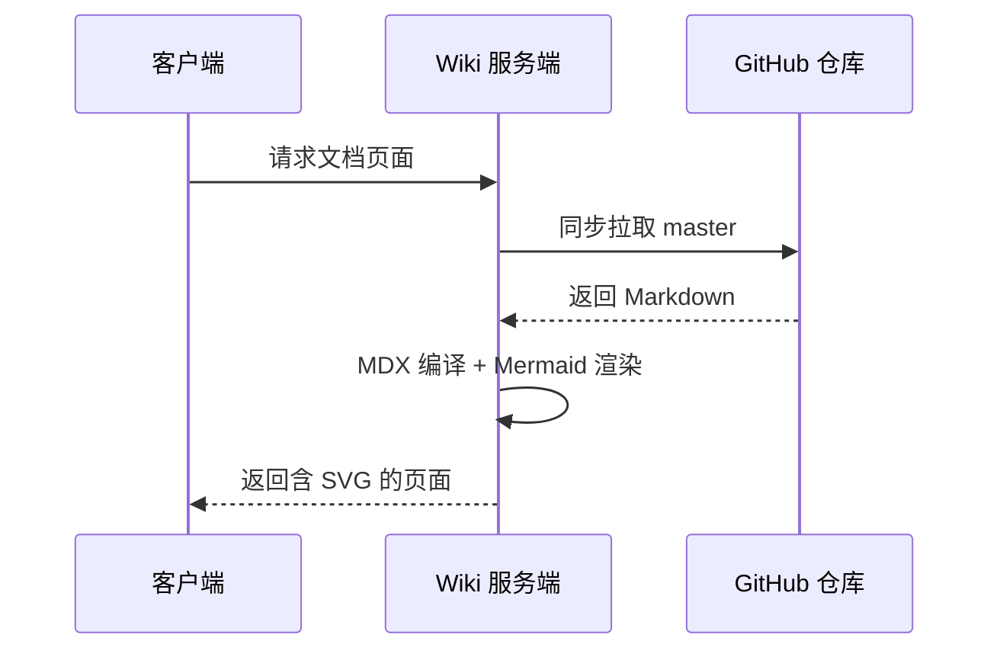

# 上手教程
- [介绍](started.md)
- [串口调试](debug.md)
# 升级固件
- [介绍](upgrade_bootmode.md)
- [使用USB线缆升级固件](upgrade_firmware.md)
- [MaskRom模式](upgrade_maskrom_mode.md)
- [使用SD卡升级固件](upgrade_firmware_sd.md)
# Linux开发
- [编译 Linux 固件](linux_compile.md)
- [Firefly Linux 开发指南](linux_firefly_linux_manual.md)
# 接口使用
- [ADC 使用](usage_adc.md)
- [Camera 使用](usage_camera.md)
- [Display 使用](usage_display.md)
- [Ethernet 使用](usage_ethernet.md)
- [GPIO 使用](usage_gpio.md)
- [LED 使用](usage_led.md)
- [RTC 使用](usage_rtc.md)
- [UART 使用](usage_uart.md)
- [Watchdog 使用](usage_watchdog.md)
- [Sound Card 使用](usage_sound_card.md)
- [POE 使用](usage_poe.md)
# 配件
- [摄像头模组](module_camera.md)
- [显示屏模组](module_display.md)
- [通信模组](module_wireless.md)
# 其他
- [NPU使用](usage_npu.md)
# 常见问题解答
- [Linux 设备树 (DTS) 指南](linux_dts_manual.md)
# 参考资料
- [接口定义](interface_definition.md)

# Mermaid 渲染测试

本章节用于验证 Wiki 文档的 Mermaid 服务端渲染效果。

## 流程图（flowchart）

## 时序图（sequenceDiagram）

## 实体关系图（erDiagram）

## 不支持的图（gantt，应降级为源码块）

